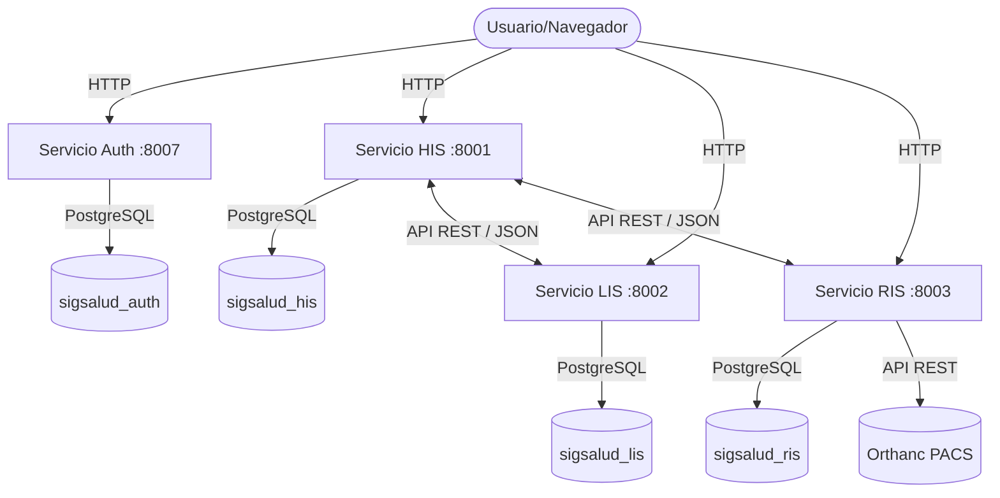
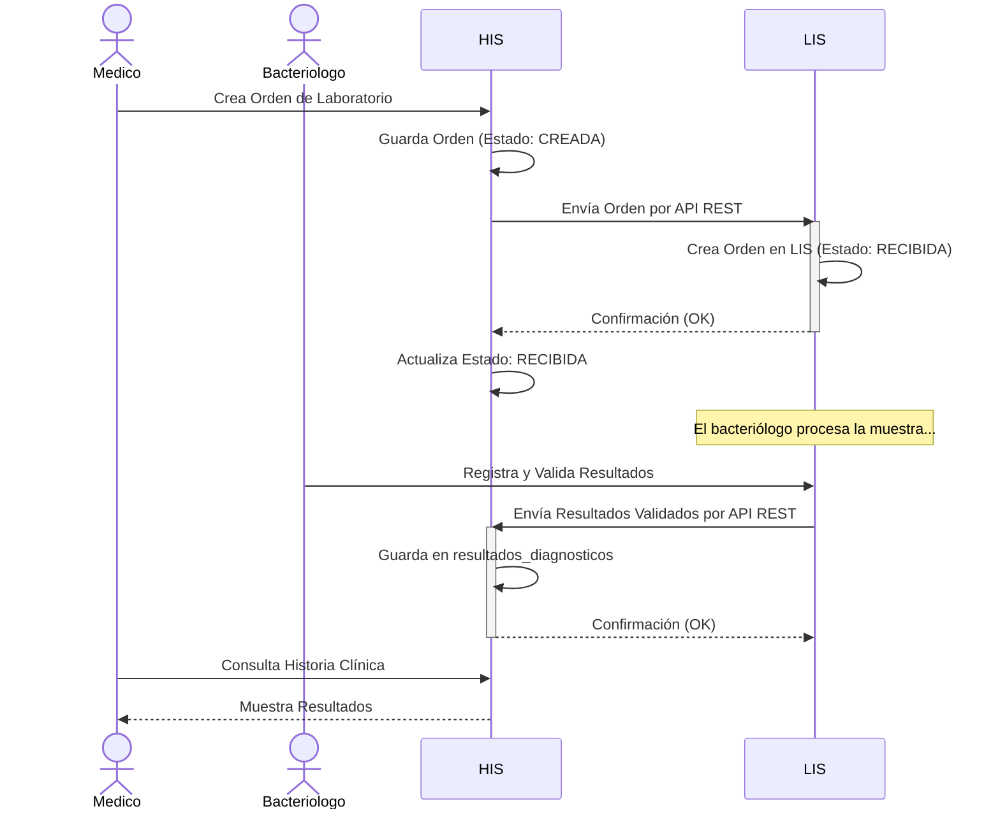
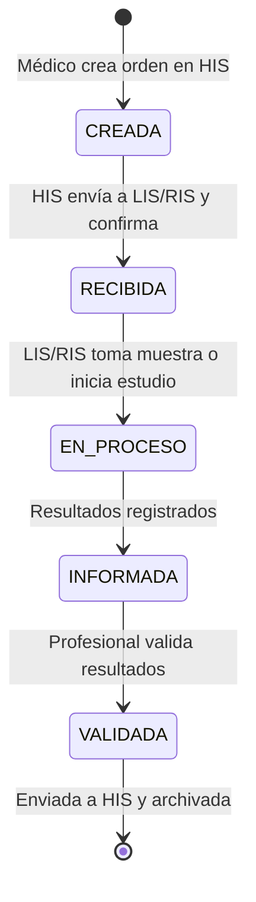
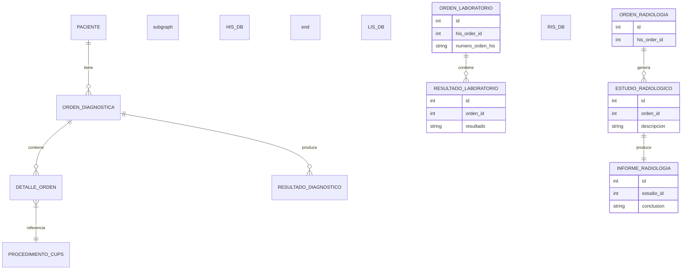

# Diagramas Técnicos - SIGSALUD

Este documento contiene los diagramas requeridos por la actividad, construidos en formato Mermaid para facilitar su visualización y trazabilidad con el código.

## 1. Diagrama de Componentes

Muestra la estructura del sistema y cómo se comunican los servicios.

---

## 2. Diagrama de Actividades (Flujo Principal)

Muestra el flujo de una orden desde su creación hasta la visualización de resultados.

---

## 3. Diagrama de Estados (Orden Diagnóstica)

Muestra los estados por los que pasa una orden en el sistema.

---

## 4. Diagrama de Entidades (Modelo de Datos Simplificado)

Muestra las relaciones principales inferidas del código y consultas SQL.

